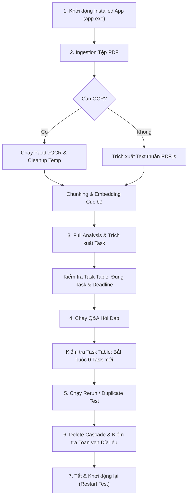

# DocNoti — Quy trình Kiểm thử Nội bộ trên Dữ liệu Thực tế
## (Internal Test Protocol on Real-World Documents)

**Mã tài liệu:** `DOCNOTI-QA-PROT-001`  
**Phiên bản áp dụng:** DocNoti v0.1.0 (Installed Release Binary)  
**Trạng thái ứng dụng hiện tại:** B — READY FOR INTERNAL TEST  
**Ngày ban hành:** 2026-09-11  

---

## 1. Mục đích & Phạm vi

### 1.1. Mục đích
Quy trình này thiết lập các bước kiểm thử nội bộ (Internal Test) nghiêm ngặt trên dữ liệu tệp PDF thực tế đối với bản cài đặt phát hành (`app.exe` đã được cài qua NSIS/MSI), nhằm đánh giá toàn diện năng lực xử lý, độ chính xác của AI, tính cách ly của tác vụ, khả năng phục hồi và tính toàn vẹn dữ liệu trước khi xem xét phát hành cho người dùng thực.

### 1.2. Nguyên tắc bắt buộc
1. **Kiểm thử trên bản cài đặt thực tế:** Tuyệt đối không kiểm thử trên `npm run tauri dev` hay môi trường mô phỏng. Toàn bộ hành vi phải được ghi nhận từ file thực thi đã cài đặt tại `%LOCALAPPDATA%\docnoti\app.exe`.
2. **Không sửa code tùy tiện trong lúc test:** Mọi bất thường, sai lệch hoặc lỗi phải được ghi nhận nguyên trạng vào báo cáo theo đúng phân cấp mức độ nghiêm trọng (P0/P1/P2/P3) trước khi đề xuất bất kỳ giải pháp khắc phục nào.
3. **Bảo tồn dữ liệu người dùng:** Không được xóa, reset hay làm biến đổi cơ sở dữ liệu `D:\tauri\docnoti.db` hiện có trừ các tệp test được tạo ra phục vụ bài test cascade delete.
4. **Trung thực về kết quả kiểm thử:** Không giả định kết quả; chỉ đánh dấu PASS khi bước kiểm thử đã thực sự chạy và đạt đầy đủ các điều kiện nghiệm thu.

---

## 2. Tiêu chí Đánh giá & Định nghĩa PASS / FAIL

Một ca kiểm thử được xem là **PASS** khi thỏa mãn đồng thời các điều kiện sau:

| Tiêu chí | Điều kiện PASS | Dấu hiệu FAIL |
| :--- | :--- | :--- |
| **Độ ổn định hệ thống** | Ứng dụng không bị crash, không bị đóng đột ngột, không treo vô hạn khi tải tài liệu lớn hoặc cấu trúc phức tạp. | Tiến trình bị tắt đột ngột, CPU 100% không giải phóng, lỗi panic unhandled. |
| **Bảo toàn dữ liệu** | Dữ liệu cũ trong database được giữ nguyên 100%. Các bản ghi mới được lưu trữ đúng cấu trúc SQLite và thư mục lưu trữ `D:\tauri\document`. | Mất tài liệu cũ, hỏng file SQLite, mất dữ liệu cấu hình lưu trữ. |
| **Không ảo giác Deadline** | Deadline chỉ được trích xuất khi có cơ sở trong văn bản. Không tự ý suy diễn hoặc gán ngày hôm nay/ngày ngẫu nhiên khi văn bản không nêu ngày cụ thể. | Tự tạo ngày tháng không có trong văn bản; tự ý biến thời hạn mơ hồ ("sau này") thành ngày cụ thể. |
| **Chứng cứ & Trích dẫn** | Mọi task hoặc khẳng định của AI đều phải có trích dẫn nguyên văn (`verbatim quote`) và chỉ rõ số trang (`pageNumber`). | Thiếu citation; số trang sai lệch; trích dẫn không khớp câu chữ trong tài liệu gốc. |
| **Cách ly Q&A** | Tính năng Hỏi & Đáp (Q&A) chỉ giải đáp thắc mắc và trả lời thông tin, **tuyệt đối không tạo bất kỳ task nào** trong cơ sở dữ liệu. | Phát sinh bản ghi mới trong bảng `tasks` sau khi người dùng thực hiện câu hỏi Q&A. |
| **Xử lý Deadline Mơ hồ** | Các mốc thời gian tương đối hoặc điều kiện (ví dụ: *"trong vòng 5 ngày"*, *"cuối tháng"*, *"sau khi nghiệm thu"*) phải được gán nhãn `RELATIVE` hoặc `AMBIGUOUS`. | Ép buộc mốc thời gian tương đối thành ngày cố định mà không có cơ sở mốc gốc; bỏ sót hạn chót. |
| **Xử lý Tài liệu Không Task** | Tài liệu chính sách, thông tin tham khảo không chứa nghĩa vụ hành động phải cho kết quả **0 task**. | Tự bịa ra task cho tài liệu chỉ có tính chất tham khảo hoặc văn bản pháp quy chung chung. |
| **Hiệu quả OCR** | Tệp PDF dạng scan hình ảnh phải kích hoạt PaddleOCR và trích xuất được văn bản rõ nghĩa nếu chất lượng quét đọc được. File tạm trong `temp_ocr` phải dọn sạch 100%. | Không kích hoạt OCR khi PDF thiếu text layer; OCR trả về rác; để sót file ảnh tạm trong ổ đĩa. |
| **Xử lý Tệp Trùng lặp** | Nhập lại cùng một tệp PDF (cùng checksum) phải được nhận diện là đã tồn tại, không sinh tài liệu trùng lặp rác. | Sinh bản ghi trùng lặp trong DB, làm xáo trộn vector embedding hoặc đè hỏng dữ liệu. |
| **Khởi động lại (Restart)** | Tắt và mở lại ứng dụng: Toàn bộ danh mục tài liệu, trạng thái xử lý, tác vụ đã trích xuất phải còn nguyên vẹn. | Mất dữ liệu sau restart; app quay về trạng thái ban đầu chưa cấu hình. |

---

## 3. Ma trận Bộ Tài liệu Kiểm thử (Test Suite Matrix)

Bộ kiểm thử bao gồm tối thiểu **18 tệp PDF thực tế** đại diện cho các tình huống nghiệp vụ đa dạng:

| Mã Test | Thể loại tài liệu | Đặc điểm cấu trúc & Nội dung | Mục tiêu kiểm thử chính |
| :--- | :--- | :--- | :--- |
| **TC-01** | Quyết định hành chính | 3–5 trang, thể thức chuẩn, có điều khoản giao việc và ngày cụ thể. | Trích xuất task hành chính, deadline cụ thể (`EXACT`), đơn vị phụ trách. |
| **TC-02** | Kế hoạch công tác | 5–10 trang, phân công nhiều phòng ban, nhiều mốc tiến độ theo quý. | Trích xuất nhiều task, gán đúng `assignee`, xử lý các mốc thời gian nối tiếp. |
| **TC-03** | Thông báo nội bộ | 1–2 trang, có mốc thời gian gồm cả **ngày + giờ cụ thể** (vd: 09h00 ngày 25/10/2026). | Chuẩn hóa thời gian cả ngày lẫn giờ, phân loại `ANNOUNCEMENT`. |
| **TC-04** | Công văn chỉ đạo | 2–4 trang, chỉ đạo khẩn, yêu cầu gửi phản hồi trước một thời điểm. | Nhận diện tính chất công việc khẩn, trích dẫn căn cứ chỉ đạo. |
| **TC-05** | Biên bản cuộc họp | 3–6 trang, nhiều ý kiến phát biểu, phần kết luận giao nhiệm vụ cho từng cá nhân. | Bóc tách đúng việc được giao trong phần kết luận; không biến ý kiến thảo luận thành task. |
| **TC-06** | Bảng phân công công việc | Dạng bảng biểu (Table) nhiều cột: STT, Tên việc, Người làm, Hạn nộp. | Khả năng đọc cấu trúc bảng, trích xuất danh sách công việc có cấu trúc. |
| **TC-07** | PDF Scan (Ảnh thuần túy) | 5–10 trang dạng quét (không có text layer), văn bản chữ in tiếng Việt. | Kích hoạt PaddleOCR tự động, độ chính xác nhận dạng chữ, dọn dẹp file tạm. |
| **TC-08** | PDF chứa bảng số liệu phức tạp | Báo cáo tài chính / tiến độ có bảng biểu nhiều dòng, số liệu và ghi chú hạn chót. | Bảo toàn định dạng văn bản bảng biểu, không làm xáo trộn ngữ nghĩa dòng/cột. |
| **TC-09** | Tài liệu nhiều ngày tháng | Quyết định chứa ngày ký, ngày hiệu lực, ngày rà soát định kỳ và ngày nộp báo cáo. | Phân biệt chính xác ngày ban hành với hạn chót hoàn thành nhiệm vụ (`deadline`). |
| **TC-10** | Tài liệu thông tin thuần túy | Sổ tay hướng dẫn, tài liệu giới thiệu nội quy (chỉ cung cấp thông tin, không có deadline). | Không ảo giác deadline; tóm tắt chuẩn xác; `deadlineType = NONE`. |
| **TC-11** | Tài liệu không chứa nhiệm vụ | Văn bản quy chuẩn, quy định chung (không giao việc cụ thể cho ai). | Xác nhận **0 task** được tạo; không sinh task giả. |
| **TC-12** | Tài liệu deadline tương đối | Chứa cụm từ *"trong vòng 5 ngày kể từ ngày nhận"*, *"trước cuối tháng sau"*. | Gán nhãn `deadlineType = RELATIVE` hoặc `AMBIGUOUS`; giữ nguyên `rawDeadline`. |
| **TC-13** | Tài liệu đa đơn vị phụ trách | Giao việc cho Ban Giám đốc, Phòng Kế hoạch, Phòng Pháp chế, Kế toán trưởng. | Trích xuất và phân loại đúng đơn vị/người phụ trách từng việc tương ứng. |
| **TC-14** | Tài liệu độ dài trung bình | Độ dài từ 15 đến 30 trang văn bản hành chính/báo cáo tổng kết. | Kiểm tra hiệu năng chunking, thời gian sinh embedding và bộ nhớ. |
| **TC-15** | Tài liệu dài (>80–100 trang) | Báo cáo kỹ thuật, luận văn hoặc đề án chi tiết (e.g. 88 trang). | Kiểm tra cơ chế lấy mẫu theo ngân sách token (`ContextBuilder`), không vượt giới hạn TPM. |
| **TC-16** | Tài liệu cực dài (>=200 trang) | Giáo trình / Tuyển tập tài liệu lớn (e.g. 219 trang). | Bounded context, tìm kiếm kết hợp (FTS5 + Vector) tìm đúng đoạn liên quan khi Q&A. |
| **TC-17** | Deadline có điều kiện | Văn bản có câu: *"Thực hiện sau khi được cơ quan cấp trên thẩm định và phê duyệt"*. | Ghi nhận tính chất điều kiện, trạng thái `UNCERTAIN` hoặc `INFERRED`. |
| **TC-18** | Tệp PDF hỏng / rỗng | Tệp PDF 0 byte hoặc file bị hỏng header. | Ứng dụng báo lỗi thân thiện, không làm sập tiến trình nền hoặc hỏng luồng. |

---

## 4. Mẫu Thu thập Dữ liệu Đánh giá Từng Tệp (Evaluation Template)

Mỗi tệp PDF sau khi chạy qua quy trình kiểm thử phải được lập một phiếu ghi nhận theo mẫu sau:

```markdown
### [TC-XX] Tên tệp: <filename>
- **Mã tệp / ID:** <Document UUID>
- **Kích thước / Số trang:** <File size> | <Page count> trang
- **Text Extraction:** Thành công / Thất bại | Tổng số ký tự: <char_count>
- **OCR:** Có cần không? (Có/Không) | OCR thành công? (Đạt/Không đạt/Bỏ qua) | Số ký tự OCR: <ocr_chars>
- **Dọn dẹp thư mục tạm:** Đạt (0 file tồn đọng) / Thất bại
- **Phân loại tài liệu (Classification):** <OFFICIAL_DOCUMENT / PLAN / ANNOUNCEMENT / REPORT / ...>
- **Chất lượng tóm tắt (Summary Quality):** Đạt / Chưa đạt (Độ mạch lạc, bao quát, không bịa đặt)
- **Nhiệm vụ trích xuất (Extracted Tasks):**
  * Task 1: Tiêu đề: "..." | Assignee: "..." | Deadline: "..." (Loại: EXACT/RELATIVE/AMBIGUOUS/NONE)
  * Task 2: ...
- **Bằng chứng & Trích dẫn (Evidence):**
  * Khớp số trang: Có/Không
  * Trích dẫn nguyên văn: Có/Không (Trích dẫn: "...")
- **Kiểm thử Q&A:**
  * Câu hỏi test: "..."
  * Câu trả lời: "..."
  * Số task sinh ra từ Q&A: 0 (Đạt) / >0 (Thất bại)
- **Chất lượng Retrieval (Hybrid Search):** Top 1 chunk có đúng đoạn cần tìm không? (Có/Không)
- **Thời gian xử lý (Processing Time):** Ingestion: <t1>s | Embedding: <t2>s | AI Analysis: <t3>s
- **Lỗi phát sinh (nếu có):** Ghi rõ mã lỗi hoặc hành vi sai lệch
- **Kết luận ca test:** PASS / FAIL
```

---

## 5. Quy trình Thực thi Kiểm thử Từng Bước



### Bước 1: Khởi động Ứng dụng Cài đặt
1. Chạy ứng dụng từ đường dẫn cài đặt thực tế: `%LOCALAPPDATA%\docnoti\app.exe`.
2. Kiểm tra tiến trình trong Task Manager / PowerShell: Xác nhận tiến trình `app.exe` đang hoạt động, bộ nhớ ban đầu ổn định (~30–45 MB).
3. Xác nhận kết nối đúng cơ sở dữ liệu `D:\tauri\docnoti.db`, không tạo thư mục rác ở `System32` hay `Program Files`.

### Bước 2: Nhập tài liệu (Ingestion) & Phân tích lớp văn bản
1. Đưa tệp PDF thuộc ma trận kiểm thử vào hệ thống.
2. Kiểm tra log hệ thống:
   - Nếu PDF có text layer: Xác nhận `needsOcr = false`, thời gian xử lý nhanh (< 1s).
   - Nếu PDF là bản scan: Xác nhận `needsOcr = true`, hệ thống gọi `scripts/ocr_runner.py` qua Python, trích xuất text và dọn dẹp file tạm trong `temp_ocr`.
3. Kiểm tra bản ghi trong bảng `documents` và `document_pages`.

### Bước 3: Phân mảnh (Chunking) & Vector Embedding
1. Hệ thống tự động phân tách văn bản thành các chunks bảo toàn nguồn gốc trang (`pageNumber`, `charStart`, `charEnd`).
2. Sinh vector embedding và lưu vào `document_chunk_embeddings`.
3. Cập nhật chỉ mục tìm kiếm toàn văn `fts_documents`.

### Bước 4: Chạy Phân tích Toàn diện (Full Analysis) & Bóc tách Task
1. Thực hiện Full Analysis với model `gpt-4o-mini` sử dụng API key từ Windows Credential Manager.
2. Kiểm tra đầu ra:
   - Phân loại tài liệu có chuẩn xác không.
   - Bản tóm tắt có phản ánh trung thực nội dung không.
   - Các task được trích xuất có đúng người, đúng việc, đúng hạn chót không.
   - Mọi task phải có `citations` trích dẫn câu từ thực tế trong tài liệu.

### Bước 5: Kiểm tra Cô lập Q&A (Task Isolation Check)
1. Đặt câu hỏi Q&A xoay quanh nội dung tài liệu (ví dụ: *"Khi nào phải nộp báo cáo?"*).
2. Kiểm tra câu trả lời dựa trên context được retrieve.
3. **Kiểm tra bảng `tasks` ngay lập tức:** Đảm bảo số lượng task không đổi; **tuyệt đối không được phát sinh thêm task** do câu hỏi Q&A tạo ra.

### Bước 6: Kiểm thử Xử lý Tệp Lớn (>100–200 trang)
1. Thực hiện phân tích trên tài liệu dài.
2. Theo dõi `tokenBudget`: Kiểm tra hàm `prepareBudgetedSummaryPages()` có chọn lọc các trang đại diện (đầu, giữa, cuối) để giữ tổng số token trong ngưỡng an toàn (~12.000–16.000 chars) hay không.
3. Xác nhận không gặp lỗi OpenAI rate limit (`429 TPM exceeded`) hoặc ngữ cảnh quá tải (`context length exceeded`).
4. Thử đặt câu hỏi Q&A chi tiết: Xác nhận hệ thống tìm đúng chunk liên quan trong số hàng trăm trang thông qua cơ chế RRF (Reciprocal Rank Fusion).

### Bước 7: Kiểm thử Xóa Liên hoàn (Delete Cascade)
1. Chọn một tài liệu test vừa hoàn thành.
2. Thực hiện lệnh xóa tài liệu.
3. Kiểm tra cơ sở dữ liệu:
   - Bản ghi tại `documents` bị xóa.
   - Toàn bộ `document_pages`, `document_chunks`, `document_chunk_embeddings`, `fts_documents`, `document_analyses`, `tasks`, `reminders` của tài liệu đó bị dọn sạch.
   - Tệp PDF vật lý trong `D:\tauri\document` bị xóa.
4. **Kiểm tra đối chiếu:** Tài liệu thực của người dùng không bị mất dù chỉ 1 chunk hay 1 trang.

### Bước 8: Kiểm thử Tắt & Khởi động lại (Restart / Autostart)
1. Đóng ứng dụng hoàn toàn.
2. Khởi động lại từ shortcut hoặc với cờ `--background`.
3. Mở giao diện: Xác nhận toàn bộ dữ liệu, danh sách tài liệu, tác vụ còn nguyên vẹn, không bị mất mát hoặc phục hồi sai cấu hình.

---

## 6. Quy tắc Ghi nhận Lỗi & Phân loại Mức độ Nghiêm trọng

Nếu bất kỳ bước nào xuất hiện kết quả không như kỳ vọng, người kiểm thử phải ghi nhận theo cấu trúc sau:

### 6.1. Phân loại mức độ nghiêm trọng (Severity Matrix)
- **P0 (Blocker):** Ứng dụng bị sập (crash), hỏng hoặc mất cơ sở dữ liệu, rò rỉ dữ liệu nhạy cảm, chức năng cốt lõi không thể tiếp tục chạy.
- **P1 (Critical):** Tính năng AI bị treo, sinh task ảo giác nghiêm trọng gây sai lệch nghiệp vụ, Q&A làm ô nhiễm bảng task, OCR làm rò rỉ đầy bộ nhớ tạm.
- **P2 (Major):** Phân loại sai loại tài liệu, trích xuất thiếu task rõ ràng, không nhận diện được deadline tương đối, lỗi định dạng bảng biểu.
- **P3 (Minor):** Câu chữ tóm tắt chưa trau chuốt, thời gian phản hồi hơi chậm nhưng vẫn trả về kết quả đúng, lỗi hiển thị nhỏ.

### 6.2. Mẫu báo cáo khuyết tật (Defect Record Schema)
```markdown
- **Mã lỗi:** DEFECT-XX
- **Mức độ nghiêm trọng:** P0 / P1 / P2 / P3
- **Tài liệu kiểm thử:** <TC-XX / Filename>
- **Bước tái hiện (Reproduction Steps):**
  1. ...
  2. ...
- **Kết quả kỳ vọng (Expected):** ...
- **Kết quả thực tế (Actual):** ...
- **Nghi vấn nguyên nhân gốc (Suspected Root Cause):** ...
- **Thành phần bị ảnh hưởng (Affected Component):** <ocr.rs / hybridRetrieval / contextBuilder / taskExtraction / ...>
```

---

## 7. Tiêu chuẩn Đánh giá Độ Sẵn sàng Phát hành (Release Readiness)

Sau khi hoàn thành toàn bộ ma trận kiểm thử và lập `docs/INTERNAL_TEST_REPORT.md`, ứng dụng sẽ được xếp loại theo một trong ba cấp độ:

1. **BLOCKED (Bị chặn):**
   - Còn tồn tại bất kỳ lỗi **P0** nào chưa được xử lý.
   - Có hiện tượng mất dữ liệu, crash, hoặc vi phạm nghiêm trọng tính cách ly Q&A/Task.
2. **INTERNAL TEST CONTINUE (Tiếp tục kiểm thử nội bộ):**
   - Không còn lỗi P0.
   - Còn một số lỗi P1/P2 cần được khắc phục và tái kiểm tra trên nhóm tài liệu chuyên biệt trước khi mở rộng.
   - Ứng dụng vận hành ổn định trong môi trường nội bộ.
3. **CANDIDATE FOR REAL USER (Ứng viên phát hành người dùng thực):**
   - 0 lỗi P0, 0 lỗi P1, các lỗi P2 đã được giải quyết hoặc có phương án kiểm soát rõ ràng.
   - Toàn bộ 18+ tài liệu thực tế đạt PASS.
   - Đáp ứng đầy đủ các nguyên tắc cốt lõi: Local-first, Privacy, Evidence-backed, Task Isolation.
